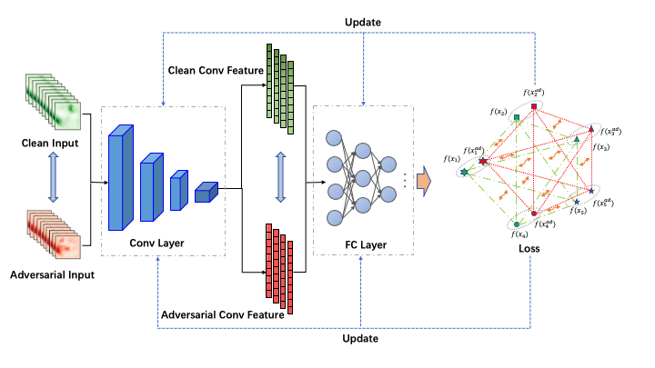
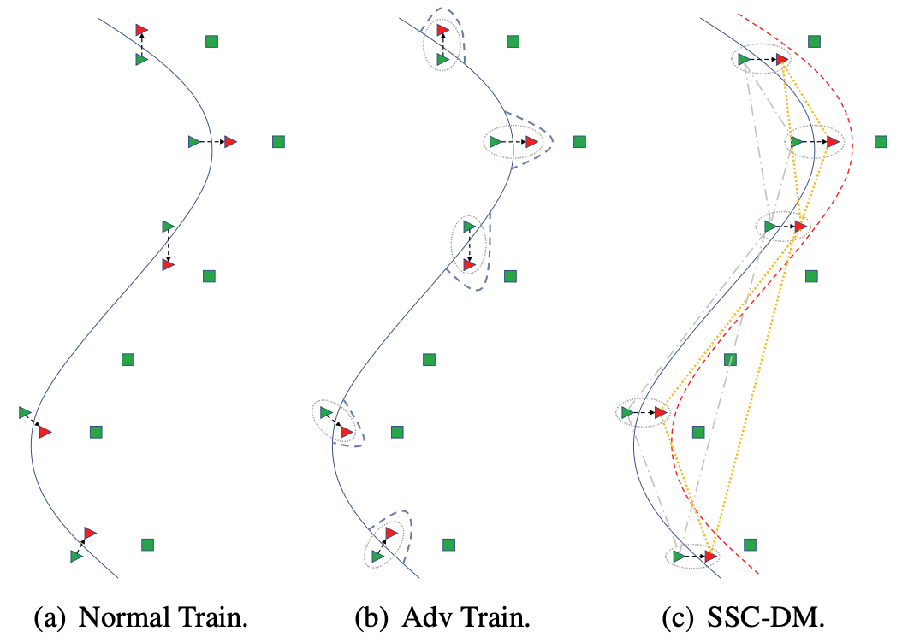
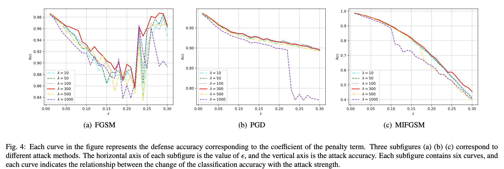

Overview
----
This repository is an implementation of the paper "[An Effective Deep Learning Adversarial Defense Method based on Spatial Structural Constraints in Embedding Space]".

Introduction
----
This paper proposes an effective deep learning adversarial defense method, which incorporates information about the spatial structures of the natural and the adversarial samples in the embedding space during the training process.

The Proposed Method
----

Let $\boldsymbol{X}={\boldsymbol{x_{1}},\boldsymbol{x_{2}},\cdots,\boldsymbol{x_{B}}}$ be the natural training set, $\boldsymbol{X_{ad}}=\{\boldsymbol{x_{1}}^{ad},\boldsymbol{x_{2}}^{ad},\cdots,\boldsymbol{x_{B}^{ad}}\}$ are the adversarial samples corresponding to $\boldsymbol{X}$, $\boldsymbol{Y}=\{y_{1},y_{2},\cdots ,y_{B}\}$ are the labels. Most of the defense methods simply add the classification loss of the adversarial samples to the loss function, which is mathematically expressed as:

$$
    L=\alpha L(\boldsymbol{\theta},\boldsymbol{X},\boldsymbol{Y})+\beta L(\boldsymbol{\theta},\boldsymbol{X_{ad}},\boldsymbol{Y})
$$

where $\boldsymbol{\theta}$ is the parameters of DNNs, and $\boldsymbol{X_{ad}}$ are the adversarial samples carfted based on $\boldsymbol{X}$. We call this method Adv Train in this paper.

Mathematically, the loss function of the method proposed in this paper is expressed as:

$$
    L=\alpha L(\boldsymbol{\theta},\boldsymbol{X},\boldsymbol{Y})+\beta L(\boldsymbol{\theta},\boldsymbol{X_{ad}},\boldsymbol{Y})+\lambda L_{s}(S(\boldsymbol{X}),S(\boldsymbol{X_{ad}}))
$$

where $S(\boldsymbol{X})$ is a $B\times B$ symmetric matrix representing the distance measure of the dataset $\boldsymbol{X}$, $S(\boldsymbol{X_{ij}})=Dis(\boldsymbol{x_{i}},\boldsymbol {x_{j}})$.

$$
    L_{s}=\frac{1}{B}\|{\rm softmax}(S(\boldsymbol{X}))-{\rm softmax}(S(\boldsymbol{X_{ad}}))\|_{2}
$$

The distance measure is expressed as:

$$
    Dis(\boldsymbol{x_{i}},\boldsymbol{x_{j}})=\sqrt{(\boldsymbol{x_{i}}-\boldsymbol{x_{j}})^{T}(\boldsymbol{x_{i}}-\boldsymbol{x_{j}})}
$$
      
Penalty Factor $\lambda$
----
The $\lambda$ is taken to be 10, 50, 100, 300, 500, and 1000 for analyzing. For LeNet-MNIST, the strength of the three attacks for each attack method, $\epsilon$, is taken to range from 0.01 to 0.3, with intervals of 0.01. The results of the experiments are shown as:

Dependencies
-----
* Python 3.11.4
* torch==2.1.0
* torchvision==0.16.0
* transformers==4.29.2
* pandas==1.5.3
* numpy==1.24.3
